# CLAUDE.md

This file provides guidance to Claude Code (claude.ai/code) when working with code in this repository.

## 반드시 지켜야 할 규칙

- Entity, 컬럼, 관계는 **반드시 아래 ERD를 그대로** 따른다.
- ERD에 없는 컬럼 추가, 타입 변경, 연관관계(@ManyToOne 등) 임의 변환 금지.
- ERD와 다른 구조가 필요한 경우 **먼저 사용자에게 확인**하고 승인 후 작업한다.

## 빌드 및 실행

```bash
# 빌드
./gradlew build

# 애플리케이션 실행
./gradlew bootRun

# 빌드 (테스트 스킵)
./gradlew build -x test
```

> 테스트는 현재 비활성화 상태(`tasks.named('test') { enabled = false }`)

## 기술 스택

- **Spring Boot 4.0.5** / Java 17
- **Spring Security** + **JWT** (jjwt 0.9.1)
- **Spring Data JPA** + **MySQL**
- **AWS S3** (aws-java-sdk 1.12.561)
- **SpringDoc OpenAPI 3.0** (Swagger UI: `/swagger-ui/index.html`)
- **Lombok**

## 패키지 구조

도메인별로 레이어를 분리하는 구조를 사용한다.

```
com.himedia.project_a_team04_backend/
├── controller/{domain}/
├── service/{domain}/
├── repository/{domain}/
├── entity/{domain}/
├── dto/{domain}/
└── exception/{domain}/
```

새 도메인 추가 시 위 구조를 그대로 따른다.

## 도메인 구성

| 도메인 | 설명 |
|--------|------|
| `user` | 회원 인증/인가, 프로필 |
| `post` | 게시글 CRUD |
| `forum` | 포럼 이벤트 관리 (다국어 지원) |
| `auth` | JWT 토큰, 이메일 인증, 비밀번호 재설정 |

## ERD

```mermaid
erDiagram
    USERS ||--o{ EMAIL_VERIFICATIONS : "1:N - 인증 이력 및 어뷰징 추적 | CASCADE"
    USERS ||--o{ PASSWORD_RESETS : "1:N - 비밀번호 변경 히스토리 | CASCADE"
    USERS ||--o{ REFRESH_TOKENS : "1:N - 다중 기기 세션 관리 | CASCADE"
    USERS ||--o{ POSTS : "1:N - 게시글 소유 관계 | RESTRICT"
    USERS ||--o{ POST_VIEWS : "1:N - 개별 사용자의 읽음 기록 | CASCADE"
    USERS ||--o{ FORUMS : "1:N - 포럼 개설 및 관리 권한 | RESTRICT"
    USERS ||--o{ FORUM_REGISTRATIONS : "1:N - 포럼 참가 신청서 제출 | CASCADE"
    USERS ||--o{ FORUM_ATTENDEES : "1:N - 최종 확정된 참석자 정보 | CASCADE"
    USERS ||--o{ USER_WITHDRAWALS : "1:N - 탈퇴 이력 기록"

    POSTS ||--o{ POST_VIEWS : "1:N - 게시글별 중복 조회 방지 로그 | CASCADE"

    FORUMS ||--o{ FORUM_TRANSLATIONS : "1:N - 국가별 언어(ko/en) 매핑 | CASCADE"
    FORUMS ||--o{ FORUM_MEDIA : "1:N - 포럼 홍보 이미지/영상 리스트 | CASCADE"
    FORUMS ||--o{ FORUM_REGISTRATIONS : "1:N - 접수된 전체 신청 현황 | RESTRICT"
    FORUMS ||--o{ FORUM_ATTENDEES : "1:N - 행사 당일 실제 출석 명단 | RESTRICT"

    USERS {
        BIGINT id PK "NOT NULL / auto_increment"
        VARCHAR(255) email "NOT NULL / UNIQUE / 로그인용 이메일"
        VARCHAR(255) password "NOT NULL / BCrypt 해시된 비밀번호"
        VARCHAR(50) nickname "NOT NULL / 서비스 활동 닉네임"
        VARCHAR(500) profile_image_url "사용자 프로필 이미지 S3 경로"
        VARCHAR role "NOT NULL / ENUM: ROLE_USER, ROLE_ADMIN"
        BOOLEAN is_active "NOT NULL / DEFAULT true / 계정 활성 상태(정지 시 false)"
        BOOLEAN email_verified "NOT NULL / DEFAULT false / 이메일 인증 완료 여부"
        BOOLEAN is_deleted "NOT NULL / DEFAULT false / 회원 탈퇴 여부(Soft Delete)"
        DATETIME created_at "NOT NULL / 계정 생성 시각"
        DATETIME updated_at "NOT NULL / 정보 수정 시각"
    }

    POSTS {
        BIGINT id PK "NOT NULL / auto_increment"
        BIGINT user_id FK "NOT NULL / 작성자 고유 ID"
        VARCHAR(255) title "NOT NULL / 게시글 제목"
        TEXT content "NOT NULL / 게시글 본문 내용"
        INT view_count "NOT NULL / DEFAULT 0 / 중복 제외 총 조회수"
        BOOLEAN is_deleted "NOT NULL / DEFAULT false / 게시글 삭제 여부"
        DATETIME created_at "NOT NULL"
        DATETIME updated_at "NOT NULL"
    }

    POST_VIEWS {
        BIGINT id PK "NOT NULL / auto_increment"
        BIGINT post_id FK "NOT NULL / UNIQUE(post, user) / 대상 게시글"
        BIGINT user_id FK "NOT NULL / UNIQUE(post, user) / 읽은 사용자"
        VARCHAR(255) ip_address "NOT NULL / 비로그인 시 식별용 IP"
        DATETIME created_at "NOT NULL / 최초 조회 시점"
    }

    EMAIL_VERIFICATIONS {
        BIGINT id PK "NOT NULL / auto_increment"
        BIGINT user_id FK "NOT NULL / 인증 대상 사용자"
        VARCHAR(255) token_hash "NOT NULL / 이메일 인증 보안 토큰"
        DATETIME expired_at "NOT NULL / 토큰 만료 시각"
        BOOLEAN verified "NOT NULL / DEFAULT false / 인증 성공 여부"
        DATETIME created_at "NOT NULL"
    }

    PASSWORD_RESETS {
        BIGINT id PK "NOT NULL / auto_increment"
        BIGINT user_id FK "NOT NULL / 요청자 고유 ID"
        VARCHAR(255) token_hash "NOT NULL / 비번 재설정 보안 토큰"
        DATETIME expired_at "NOT NULL / 토큰 만료 시각"
        BOOLEAN used "NOT NULL / DEFAULT false / 토큰 사용 완료 여부"
        DATETIME created_at "NOT NULL"
    }

    REFRESH_TOKENS {
        BIGINT id PK "NOT NULL / auto_increment"
        BIGINT user_id FK "NOT NULL / 토큰 소유자"
        VARCHAR(255) token_hash "NOT NULL / 리프레시 토큰 값"
        VARCHAR(255) device_info "접속 기기/브라우저 정보(User-Agent)"
        DATETIME expired_at "NOT NULL / 토큰 만료 시각"
        DATETIME created_at "NOT NULL"
    }

    FORUMS {
        BIGINT id PK "NOT NULL / auto_increment"
        VARCHAR(100) slug "NOT NULL / UNIQUE / URL용 고유 키(예: tech-forum-2026)"
        VARCHAR status "NOT NULL / ENUM: UPCOMING, IN_PROGRESS, CLOSED, FINISHED"
        DATETIME event_date "NOT NULL / 실제 포럼 개최 일시"
        VARCHAR(500) thumbnail_url "포럼 대표 이미지 S3 주소"
        INT max_participants "NOT NULL / 최대 모집 인원"
        BIGINT created_by FK "NOT NULL / 개설 관리자 ID"
        DATETIME created_at "NOT NULL"
        DATETIME updated_at "NOT NULL"
    }

    FORUM_TRANSLATIONS {
        BIGINT id PK "NOT NULL / auto_increment"
        BIGINT forum_id FK "NOT NULL / 부모 포럼 고유 ID"
        VARCHAR(10) locale "NOT NULL / 언어 구분(ko, en)"
        VARCHAR(255) title "NOT NULL / 언어별 제목"
        TEXT description "NOT NULL / 언어별 상세 소개"
        VARCHAR(255) location "NOT NULL / 언어별 개최 장소 명칭"
        TEXT speakers "해당 언어별 연사자 정보 기록"
        DATETIME created_at "NOT NULL"
        DATETIME updated_at "NOT NULL"
    }

    FORUM_MEDIA {
        BIGINT id PK "NOT NULL / auto_increment"
        BIGINT forum_id FK "NOT NULL / 관련 포럼 ID"
        VARCHAR media_type "NOT NULL / ENUM: IMAGE, YOUTUBE, VIDEO"
        VARCHAR(500) url "NOT NULL / 파일 경로 또는 외부 링크"
        VARCHAR(500) thumbnail_url "영상류 미리보기 썸네일"
        INT sort_order "NOT NULL / DEFAULT 0 / 정렬 순서"
        DATETIME created_at "NOT NULL"
    }

    FORUM_REGISTRATIONS {
        BIGINT id PK "NOT NULL / auto_increment"
        BIGINT forum_id FK "NOT NULL / 신청한 포럼 ID"
        BIGINT user_id FK "NOT NULL / 신청한 사용자 ID"
        VARCHAR status "NOT NULL / ENUM: WAITING, ACCEPTED, REJECTED"
        TEXT note "신청 시 작성한 비고/메모"
        TEXT reject_reason "심사 거절 시 관리자가 작성한 사유"
        BIGINT reviewed_by FK "심사 담당 관리자 ID"
        DATETIME reviewed_at "심사 승인/거절 처리 시각"
        DATETIME created_at "NOT NULL / 신청 일시"
        DATETIME updated_at "NOT NULL"
    }

    FORUM_ATTENDEES {
        BIGINT id PK "NOT NULL / auto_increment"
        BIGINT forum_id FK "NOT NULL / 확정된 포럼 ID"
        BIGINT user_id FK "NOT NULL / 참가 확정된 사용자 ID"
        VARCHAR status "NOT NULL / ENUM: ATTENDED, CANCELLED, NO_SHOW"
        DATETIME created_at "NOT NULL / 참석 확정 시각"
        DATETIME updated_at "NOT NULL"
    }

    USER_WITHDRAWALS {
        BIGINT id PK "NOT NULL / auto_increment"
        BIGINT user_id FK "탈퇴 유저 ID (기록 보존용)"
        TEXT reason "NOT NULL / 탈퇴 사유 (선택 항목 또는 직접 입력 사유 통합)"
        DATETIME withdrawn_at "NOT NULL / 탈퇴 처리 완료 시각"
        DATETIME created_at "NOT NULL"
    }
```



## WBS (작업 목록)

**프론트엔드 화면 구현**
- 로그인 / 회원가입 / 비밀번호 재설정 / 프로필 페이지
- 포럼 리스트 / 등록 / 상세(수정·삭제)
- 자유게시판 리스트 / 글쓰기 / 상세(수정·삭제)
- 메인 페이지

**프론트엔드 API 연동**
- 회원가입, 로그인·로그아웃(JWT), 비밀번호 재설정
- 포럼 리스트·페이징, 상세, 등록·수정·삭제
- 자유게시판 CRUD, 프로필 사용자 상세

**백엔드 API 구현**
- 회원가입 / 로그인·JWT 발급 / 로그아웃 / 비밀번호 재설정(Brevo)
- 사용자 프로필 조회·수정
- 포럼 리스트·페이징 / 등록·상세·수정·삭제
- 자유게시판 리스트·페이징 / 글쓰기·상세·수정·삭제
- 이미지·파일 업로드 (S3)
- 권한 검증 및 인가 로직

**데이터베이스**
- 요구사항 분석 및 엔티티 도출
- ERD 설계 및 스키마 스크립트 작성
- 테이블 생성·제약 조건·접근 계정 설정

**인프라 (AWS)**
- VPC / 퍼블릭·프라이빗 서브넷 설계
- EC2 생성·보안그룹 / S3 버킷·권한 / RDS 생성·EC2 연결
- ALB 설정 / Route53 도메인·SSL 인증서

**CI/CD**
- GitHub Actions 빌드·테스트 워크플로우
- IAM 권한 설정 / ArgoCD 설치·서버 등록
- 배포 매니페스트 관리 / 자동 배포 파이프라인
- 환경 변수·보안 설정 / 배포 알림 시스템

## 주요 설계 원칙

- **Soft Delete**: `USERS`, `POSTS`는 `is_deleted` 플래그로 논리 삭제
- **조회수 중복 방지**: `POST_VIEWS`에 `UNIQUE(post_id, user_id)` 제약, 비로그인은 IP로 식별
- **포럼 다국어**: `FORUM_TRANSLATIONS`에 `locale(ko/en)` 로 분리 저장
- **포럼 신청 흐름**: `FORUM_REGISTRATIONS(WAITING→ACCEPTED/REJECTED)` → `FORUM_ATTENDEES`
- **JWT**: Access Token + Refresh Token 구조, `REFRESH_TOKENS` 테이블로 다중 기기 세션 관리
- **역할**: `ROLE_USER`, `ROLE_ADMIN` 두 가지
